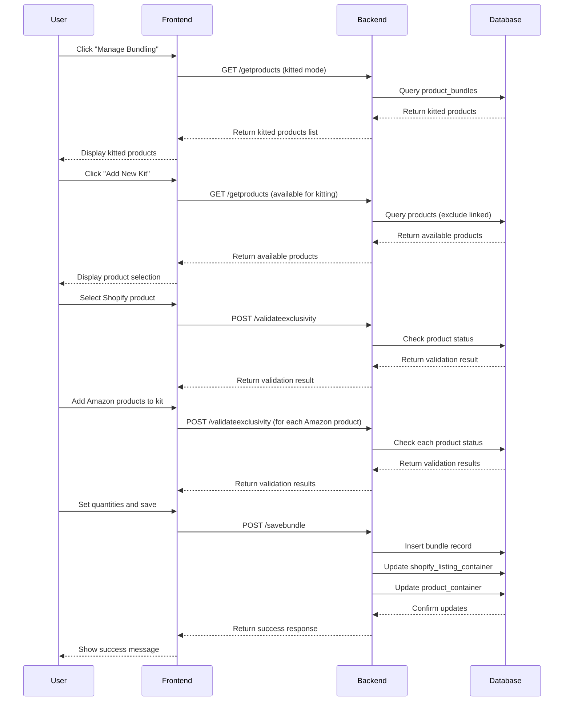
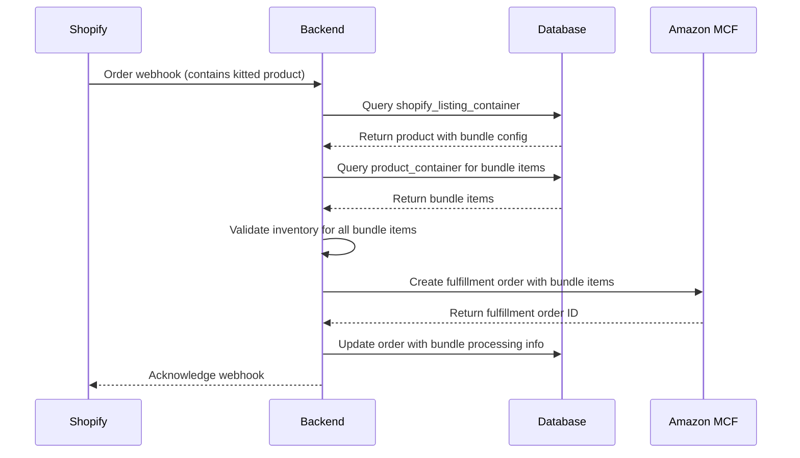
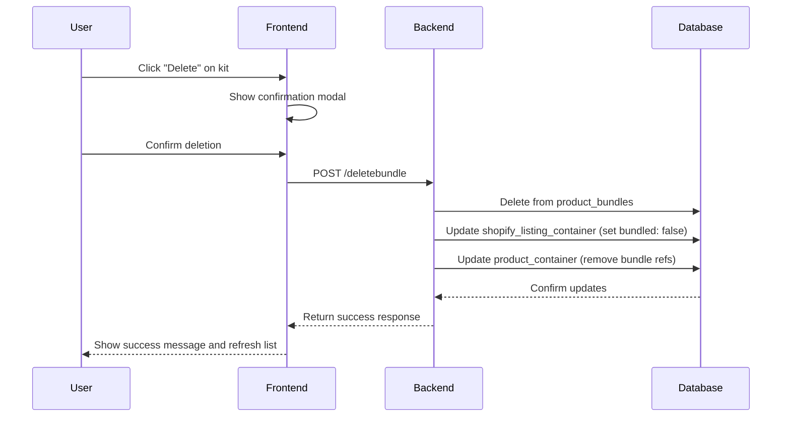

# Kitting Functionality - Developer Documentation

## Table of Contents
1. [Overview](#overview)
2. [Architecture](#architecture)
3. [Database Schema](#database-schema)
4. [API Endpoints](#api-endpoints)
5. [Sequence Diagrams](#sequence-diagrams)
6. [Frontend Components](#frontend-components)
7. [Use Cases](#use-cases)
8. [Validation Rules](#validation-rules)
9. [Error Handling](#error-handling)
10. [Testing](#testing)
11. [Troubleshooting](#troubleshooting)

## Overview

The Kitting (Virtual Bundling) functionality allows users to create virtual product bundles by combining one Shopify product with multiple Amazon MCF products. This enables fulfillment of complex product combinations through Amazon's Multi-Channel Fulfillment service.

### Key Concepts
- **Kit**: A virtual bundle consisting of 1 Shopify product + multiple Amazon MCF products
- **Bundle Item**: Individual Amazon MCF products within a kit
- **Exclusivity Rule**: A product cannot be both linked and kitted simultaneously
- **Virtual Bundling**: The process of creating kits without physical bundling

## Architecture

### System Components

```
┌─────────────────┐    ┌─────────────────┐    ┌─────────────────┐
│   Frontend      │    │   Backend       │    │   Database      │
│   (React)       │◄──►│   (PHP/Phalcon) │◄──►│   (MongoDB)     │
└─────────────────┘    └─────────────────┘    └─────────────────┘
         │                       │                       │
         │                       │                       │
    ┌────▼────┐            ┌─────▼────┐            ┌─────▼────┐
    │Virtual  │            │Manual    │            │product_  │
    │Bundling │            │Controller│            │bundles   │
    │Modal    │            │          │            │          │
    └─────────┘            └──────────┘            └──────────┘
```

### Data Flow
1. User selects Shopify product for kitting
2. System validates product eligibility (not linked)
3. User adds Amazon MCF products to kit
4. System validates Amazon products (not linked)
5. User sets quantities for each product
6. System saves bundle configuration
7. Orders with kitted products are processed through MCF

## Database Schema

### product_bundles Collection

```javascript
{
  "_id": ObjectId,
  "target": {
    "source_product_id": String,        // Shopify product ID
    "container_id": String,             // Shopify container ID
    "shop_id": String,                  // Target shop ID
    "marketplace": String,              // Target marketplace (e.g., "shopify")
    "bundledQty": Number               // Quantity of Shopify product in kit
  },
  "row": [                              // Array of Amazon MCF products
    {
      "source_product_id": String,      // Amazon product ID
      "sku": String,                    // Amazon SKU
      "container_id": String,           // Amazon container ID
      "title": String,                  // Product title
      "quantity": Number,               // Quantity in kit
      "price": Number,                  // Product price
      "inventory": Number,              // Available inventory
      "total_quantity_to_show": Number, // Display quantity
      "total_bb_quantity_to_show": Number // Blank box quantity (if enabled)
    }
  ],
  "source": {
    "shop_id": String,                  // Source shop ID
    "marketplace": String               // Source marketplace (e.g., "amazonmcf")
  },
  "created_at": Date,
  "updated_at": Date
}
```

### shopify_listing_container Collection (Updated)

```javascript
{
  "_id": ObjectId,
  "source_product_id": String,
  "sku": String,
  "title": String,
  "bundled": Boolean,                   // true if product is kitted
  "bundle": [                           // Bundle configuration (if kitted)
    {
      "source_product_id": String,      // Amazon product ID
      "sku": String,                    // Amazon SKU
      "container_id": String,           // Amazon container ID
      "quantity": Number                // Quantity in kit
    }
  ],
  "linkType": String,                   // "linked", "closematch", null
  "shop_id": String,
  "marketplace": String
}
```

### product_container Collection (Updated)

```javascript
{
  "_id": ObjectId,
  "source_product_id": String,
  "sku": String,
  "title": String,
  "bundle": [                           // Bundle configuration (if part of kit)
    {
      "shopify_product_id": String,     // Shopify product ID
      "quantity": Number                // Quantity in kit
    }
  ],
  "linkType": String,                   // "linked", "closematch", null
  "shop_id": String,
  "marketplace": String
}
```

## API Endpoints

### 1. Get Kitted Products

**Endpoint**: `POST /amazonmcf/productlinking/getproducts`

**Request**:
```json
{
  "target_marketplace": "shopify",
  "mode": "kitted",
  "source_marketplace": "amazonmcf",
  "shop_id": "shop_id",
  "source_shop_id": "source_shop_id",
  "filter": {
    "search_keyword": "",
    "current_page": 1,
    "pagination_size": 50,
    "bundled": true
  },
  "operation": "getproducts"
}
```

**Response**:
```json
{
  "success": true,
  "data": {
    "rows": [
      {
        "source_product_id": "shopify_product_1",
        "sku": "SHOP-SKU-001",
        "title": "Shopify Product",
        "bundled": true,
        "bundle": [
          {
            "source_product_id": "amazon_product_1",
            "sku": "AMZ-SKU-001",
            "quantity": 2
          }
        ]
      }
    ],
    "total_count": 10
  }
}
```

### 2. Save Bundle

**Endpoint**: `POST /amazonmcf/productlinking/savebundle`

**Request**:
```json
{
  "target": {
    "source_product_id": "shopify_product_1",
    "container_id": "container_1",
    "shop_id": "shop_id",
    "marketplace": "shopify",
    "bundledQty": 1
  },
  "row": [
    {
      "source_product_id": "amazon_product_1",
      "sku": "AMZ-SKU-001",
      "container_id": "amazon_container_1",
      "quantity": 2
    }
  ],
  "operation": "updatebundle",
  "source": {
    "shop_id": "source_shop_id",
    "marketplace": "amazonmcf"
  }
}
```

### 3. Delete Bundle

**Endpoint**: `POST /amazonmcf/productlinking/deletebundle`

**Request**:
```json
{
  "target": {
    "source_product_id": "shopify_product_1",
    "shop_id": "shop_id",
    "marketplace": "shopify"
  },
  "operation": "deletebundle",
  "source": {
    "shop_id": "source_shop_id",
    "marketplace": "amazonmcf"
  }
}
```

### 4. Validate Product Exclusivity

**Endpoint**: `POST /amazonmcf/productlinking/validateexclusivity`

**Request**:
```json
{
  "product_id": "product_1",
  "shop_id": "shop_id",
  "marketplace": "shopify",
  "operation": "validate_kitting"
}
```

**Response**:
```json
{
  "success": true,
  "data": {
    "can_proceed": true,
    "is_linked": false,
    "is_kitted": false,
    "message": "Product is eligible for kitting"
  }
}
```

## Sequence Diagrams

### 1. Create Kit Sequence



### 2. Order Processing with Kits



### 3. Delete Kit Sequence



## Frontend Components

### 1. VirtualBundling Component

**File**: `app/react_app/src/components/ProductLinking/components/VirtualBundling.tsx`

**Purpose**: Main component for managing kitted products

**Key Features**:
- Display list of kitted products
- Search and filter functionality
- Pagination support
- Delete kit functionality
- Open modal for creating new kits

**State Management**:
```typescript
interface VirtualBundlingState {
  bundleModal: boolean;
  shopifySearch: string;
  shopifyListing: any[];
  shopifyLoading: boolean;
  pagination: {
    activePage: number;
    count: string;
  };
  totalProducts: number;
  bundledData: {
    shopify: any;
    amazon: any[];
  };
  errors: {
    shopify: boolean;
    amazon: Record<number, boolean>;
  };
}
```

### 2. VirtualBundlingModal Component

**File**: `app/react_app/src/components/ProductLinking/components/VirtualBundlingModal.tsx`

**Purpose**: Modal for creating and editing kits

**Key Features**:
- Shopify product selection
- Amazon MCF product search and selection
- Quantity management
- Validation before saving
- Error handling

**Props Interface**:
```typescript
interface VirtualBundlingI {
  bundledData: any;
  handleShopifyVirtualBundleChange?: (key: string, value: number) => void;
  handlePushToBundle?: (value: any) => void;
  handleRemoveFromBundle?: (id: number) => void;
  handleAmazonVirtualBundleChange?: (index: number, key: string, value: number) => void;
  errors?: any;
}
```

### 3. ProductExclusivityIndicator Component

**File**: `app/react_app/src/components/ProductLinking/components/ProductExclusivityIndicator.tsx`

**Purpose**: Visual indicator for product exclusivity status

**Features**:
- Shows if product is linked or kitted
- Tooltips explaining exclusivity rules
- Color-coded indicators

## Use Cases

### Use Case 1: Create a Simple Kit

**Actor**: Store Manager

**Preconditions**:
- Shopify store connected to Amazon MCF
- Products available in both platforms
- Products not already linked or kitted

**Steps**:
1. Navigate to Product Linking → Virtual Bundling
2. Click "Add New Kit"
3. Select a Shopify product from the list
4. Search and select Amazon MCF products
5. Set quantities for each product
6. Click "Done" to save the kit

**Postconditions**:
- Kit is created and stored in database
- Shopify product marked as `bundled: true`
- Amazon products updated with bundle references
- Kit appears in kitted products list

### Use Case 2: Process Order with Kit

**Actor**: System (Automated)

**Preconditions**:
- Kit exists in database
- Order received from Shopify with kitted product
- All bundle items have sufficient inventory

**Steps**:
1. Receive order webhook from Shopify
2. Identify kitted products in order
3. Query bundle configuration
4. Validate inventory for all bundle items
5. Create Amazon MCF fulfillment order
6. Update order with bundle processing info

**Postconditions**:
- Fulfillment order created in Amazon MCF
- Order updated with bundle processing details
- Inventory adjusted for all bundle items

### Use Case 3: Delete Kit

**Actor**: Store Manager

**Preconditions**:
- Kit exists in database
- No pending orders with this kit

**Steps**:
1. Navigate to Virtual Bundling
2. Find the kit in the list
3. Click "Delete" button
4. Confirm deletion in modal
5. Kit is removed from system

**Postconditions**:
- Kit removed from product_bundles collection
- Shopify product marked as `bundled: false`
- Amazon products updated to remove bundle references
- Kit no longer appears in list

## Validation Rules

### 1. Product Exclusivity

```typescript
// A product cannot be both linked and kitted
if (product.isLinked && product.isKitted) {
  throw new Error("Product cannot be both linked and kitted");
}
```

### 2. Kit Composition

```typescript
// Kit must have exactly 1 Shopify product
if (kit.shopifyProducts.length !== 1) {
  throw new Error("Kit must contain exactly one Shopify product");
}

// Kit must have at least 2 Amazon MCF products
if (kit.amazonProducts.length < 2) {
  throw new Error("Kit must contain at least two Amazon MCF products");
}
```

### 3. Quantity Validation

```typescript
// All quantities must be positive integers
kit.amazonProducts.forEach(product => {
  if (!Number.isInteger(product.quantity) || product.quantity <= 0) {
    throw new Error("All quantities must be positive integers");
  }
});
```

### 4. Inventory Validation

```typescript
// Check if sufficient inventory exists for all bundle items
const hasSufficientInventory = bundleItems.every(item => 
  item.availableInventory >= (item.quantity * orderQuantity)
);
```

## Error Handling

### Common Error Scenarios

1. **Product Already Linked**
   ```
   Error: "This product is already linked and cannot be added to a kit. 
   Please unlink it first to enable kitting."
   ```

2. **Product Already Kitted**
   ```
   Error: "This product is already part of a kit and cannot be linked individually. 
   Please remove it from the kit first to enable linking."
   ```

3. **Insufficient Inventory**
   ```
   Error: "Insufficient inventory for bundle item SKU-001. 
   Required: 5, Available: 3"
   ```

4. **Invalid Kit Configuration**
   ```
   Error: "Kit must contain at least two Amazon MCF products"
   ```

### Error Response Format

```json
{
  "success": false,
  "message": "Error description",
  "error_code": "VALIDATION_ERROR",
  "details": {
    "field": "product_id",
    "value": "invalid_value",
    "constraint": "must_not_be_linked"
  }
}
```

## Testing

### Unit Tests

**Test File**: `tests/KittingFunctionalityTest.php`

```php
class KittingFunctionalityTest extends TestCase
{
    public function testCreateKitWithValidProducts()
    {
        // Test creating a kit with valid, unlinked products
    }
    
    public function testPreventKittingLinkedProduct()
    {
        // Test that linked products cannot be kitted
    }
    
    public function testPreventLinkingKittedProduct()
    {
        // Test that kitted products cannot be linked
    }
    
    public function testProcessOrderWithKit()
    {
        // Test order processing with kitted products
    }
    
    public function testDeleteKit()
    {
        // Test kit deletion and cleanup
    }
}
```

### Integration Tests

**Test Scenarios**:

1. **End-to-End Kit Creation**
   - Create kit through UI
   - Verify database updates
   - Test order processing

2. **Exclusivity Validation**
   - Link a product, then try to kit it
   - Kit a product, then try to link it
   - Verify proper error messages

3. **Order Processing**
   - Create order with kitted product
   - Verify MCF fulfillment order creation
   - Check inventory updates

### Manual Testing Checklist

- [ ] Create new kit with valid products
- [ ] Try to kit already linked product (should fail)
- [ ] Try to link already kitted product (should fail)
- [ ] Edit existing kit quantities
- [ ] Delete kit and verify cleanup
- [ ] Process order with kitted product
- [ ] Test with insufficient inventory
- [ ] Verify UI validation messages
- [ ] Test search and pagination
- [ ] Test error handling scenarios

## Troubleshooting

### Common Issues

1. **Kit Not Saving**
   - Check product exclusivity validation
   - Verify all required fields are filled
   - Check database connection

2. **Orders Not Processing**
   - Verify bundle configuration exists
   - Check inventory levels for all bundle items
   - Review MCF API responses

3. **UI Not Updating**
   - Check API response format
   - Verify state management
   - Check for JavaScript errors

### Debug Commands

```bash
# Check kitted products in database
db.product_bundles.find({})

# Check product exclusivity status
db.shopify_listing_container.find({
  "source_product_id": "product_id"
})

# Check bundle configuration
db.product_container.find({
  "bundle": { "$exists": true }
})
```

### Log Analysis

```php
// Enable debug logging
$logger->debug('Kit creation attempt', [
    'shopify_product' => $shopifyProductId,
    'amazon_products' => $amazonProducts,
    'validation_result' => $validationResult
]);
```

## Performance Considerations

1. **Database Indexes**
   ```javascript
   // Index for efficient product queries
   db.shopify_listing_container.createIndex({
     "shop_id": 1,
     "bundled": 1,
     "linkType": 1
   })
   
   // Index for bundle lookups
   db.product_bundles.createIndex({
     "target.shop_id": 1,
     "target.source_product_id": 1
   })
   ```

2. **Caching Strategy**
   - Cache frequently accessed bundle configurations
   - Cache product exclusivity status
   - Implement cache invalidation on updates

3. **API Optimization**
   - Use pagination for large product lists
   - Implement request debouncing for search
   - Batch database operations where possible

## Future Enhancements

1. **Bulk Operations**
   - Bulk kit creation
   - Bulk kit deletion
   - Bulk quantity updates

2. **Advanced Features**
   - Kit templates
   - Conditional bundling
   - Dynamic pricing

3. **Analytics**
   - Kit performance metrics
   - Inventory optimization
   - Usage analytics

4. **Integration Improvements**
   - Real-time inventory sync
   - Automated kit suggestions
   - Smart bundling algorithms
