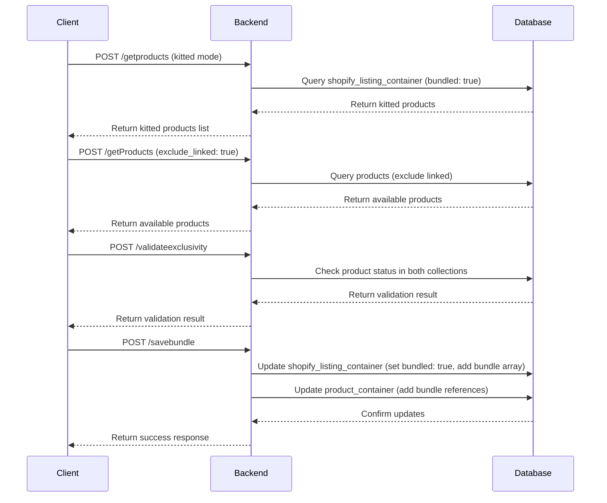
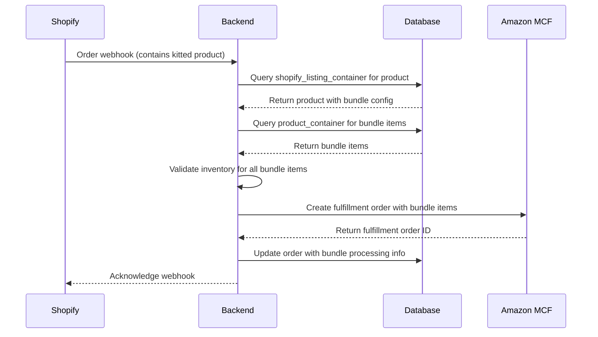
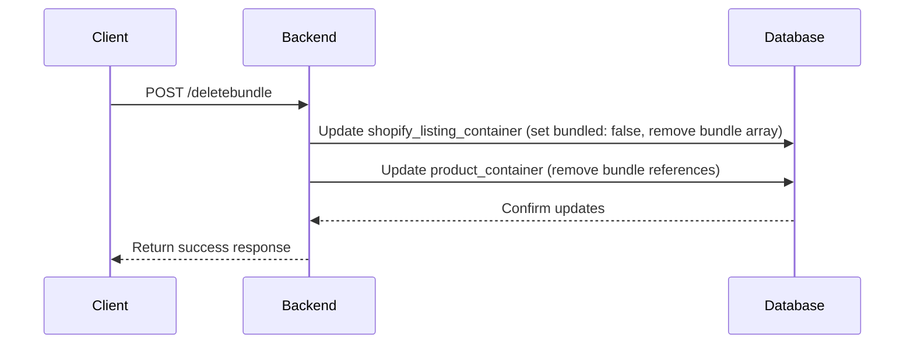

# Kitting Functionality - Backend Developer Documentation

## Table of Contents
1. [Overview](#overview)
2. [Architecture](#architecture)
3. [Database Schema](#database-schema)
4. [API Endpoints](#api-endpoints)
5. [Sequence Diagrams](#sequence-diagrams)
6. [Use Cases](#use-cases)
7. [Validation Rules](#validation-rules)
8. [Error Handling](#error-handling)
9. [Testing](#testing)
10. [Troubleshooting](#troubleshooting)

## Overview

The Kitting (Virtual Bundling) functionality allows users to create virtual product bundles by combining one Shopify product with multiple Amazon MCF products. This enables fulfillment of complex product combinations through Amazon's Multi-Channel Fulfillment service.

### Key Concepts
- **Kit**: A virtual bundle consisting of 1 Shopify product + multiple Amazon MCF products
- **Bundle Item**: Individual Amazon MCF products within a kit
- **Exclusivity Rule**: A product cannot be both linked and kitted simultaneously
- **Virtual Bundling**: The process of creating kits without physical bundling

## Architecture

### System Components

```
┌─────────────────┐    ┌─────────────────┐    ┌─────────────────┐
│   Frontend      │    │   Backend       │    │   Database      │
│   (React)       │◄──►│   (PHP/Phalcon) │◄──►│   (MongoDB)     │
└─────────────────┘    └─────────────────┘    └─────────────────┘
         │                       │                       │
         │                       │                       │
    ┌────▼────┐            ┌─────▼────┐            ┌─────▼────┐
    │API      │            │Manual    │            │shopify_  │
    │Client   │            │Controller│            │listing_  │
    │         │            │          │            │container │
    └─────────┘            └──────────┘            └──────────┘
```

### Data Flow
1. User selects Shopify product for kitting
2. System validates product eligibility (not linked)
3. User adds Amazon MCF products to kit
4. System validates Amazon products (not linked)
5. User sets quantities for each product
6. System saves bundle configuration
7. Orders with kitted products are processed through MCF

## Database Schema

### shopify_listing_container Collection (Kitting Management)

```javascript
{
  "_id": ObjectId,
  "source_product_id": String,          // Shopify product ID
  "sku": String,                        // Shopify SKU
  "title": String,                      // Product title
  "bundled": Boolean,                   // true if product is kitted
  "bundle": [                           // Bundle configuration (if kitted)
    {
      "source_product_id": String,      // Amazon product ID
      "sku": String,                    // Amazon SKU
      "container_id": String,           // Amazon container ID
      "quantity": Number                // Quantity in kit
    }
  ],
  "linkType": String,                   // "linked", "closematch", null
  "shop_id": String,                    // Shop ID
  "marketplace": String,                // Marketplace (e.g., "shopify")
  "created_at": Date,
  "updated_at": Date
}
```

### product_container Collection (Amazon MCF Products)

```javascript
{
  "_id": ObjectId,
  "source_product_id": String,          // Amazon product ID
  "sku": String,                        // Amazon SKU
  "title": String,                      // Product title
  "bundle": [                           // Bundle configuration (if part of kit)
    {
      "shopify_product_id": String,     // Shopify product ID
      "quantity": Number                // Quantity in kit
    }
  ],
  "linkType": String,                   // "linked", "closematch", null
  "shop_id": String,                    // Shop ID
  "marketplace": String,                // Marketplace (e.g., "amazonmcf")
  "price": Number,                      // Product price
  "inventory": Number,                  // Available inventory
  "total_quantity_to_show": Number,     // Display quantity
  "total_bb_quantity_to_show": Number,  // Blank box quantity (if enabled)
  "created_at": Date,
  "updated_at": Date
}
```

## API Endpoints

### 1. Get Kitted Products

**Endpoint**: `POST /amazonmcf/productlinking/getproducts`

**Request**:
```json
{
  "target_marketplace": "shopify",
  "mode": "kitted",
  "source_marketplace": "amazonmcf",
  "shop_id": "shop_id",
  "source_shop_id": "source_shop_id",
  "filter": {
    "search_keyword": "",
    "current_page": 1,
    "pagination_size": 50,
    "bundled": true
  },
  "operation": "getproducts"
}
```

**Response**:
```json
{
  "success": true,
  "data": {
    "rows": [
      {
        "source_product_id": "shopify_product_1",
        "sku": "SHOP-SKU-001",
        "title": "Shopify Product",
        "bundled": true,
        "bundle": [
          {
            "source_product_id": "amazon_product_1",
            "sku": "AMZ-SKU-001",
            "quantity": 2
          }
        ]
      }
    ],
    "total_count": 10
  }
}
```

### 2. Save Bundle

**Endpoint**: `POST /amazonmcf/productlinking/savebundle`

**Request**:
```json
{
  "target": {
    "source_product_id": "shopify_product_1",
    "container_id": "container_1",
    "shop_id": "shop_id",
    "marketplace": "shopify",
    "bundledQty": 1
  },
  "row": [
    {
      "source_product_id": "amazon_product_1",
      "sku": "AMZ-SKU-001",
      "container_id": "amazon_container_1",
      "quantity": 2
    }
  ],
  "operation": "updatebundle",
  "source": {
    "shop_id": "source_shop_id",
    "marketplace": "amazonmcf"
  }
}
```

**Response**:
```json
{
  "success": true,
  "message": "Bundle created successfully",
  "data": {
    "bundle_id": "generated_bundle_id"
  }
}
```

### 3. Delete Bundle

**Endpoint**: `POST /amazonmcf/productlinking/deletebundle`

**Request**:
```json
{
  "target": {
    "source_product_id": "shopify_product_1",
    "shop_id": "shop_id",
    "marketplace": "shopify"
  },
  "operation": "deletebundle",
  "source": {
    "shop_id": "source_shop_id",
    "marketplace": "amazonmcf"
  }
}
```

**Response**:
```json
{
  "success": true,
  "message": "Bundle deleted successfully"
}
```

### 4. Validate Product Exclusivity

**Endpoint**: `POST /amazonmcf/productlinking/validateexclusivity`

**Request**:
```json
{
  "product_id": "product_1",
  "shop_id": "shop_id",
  "marketplace": "shopify",
  "operation": "validate_kitting"
}
```

**Response**:
```json
{
  "success": true,
  "data": {
    "can_proceed": true,
    "is_linked": false,
    "is_kitted": false,
    "message": "Product is eligible for kitting"
  }
}
```

### 5. Get Products Available for Kitting

**Endpoint**: `POST /amazonmcf/product/getProducts`

**Request**:
```json
{
  "source": {
    "shopId": "source_shop_id",
    "marketplace": "source_marketplace"
  },
  "target": {
    "shopId": "target_shop_id",
    "marketplace": "target_marketplace"
  },
  "count": 50,
  "activePage": 1,
  "exclude_linked": true,
  "data": {
    "user_id": "user_id"
  }
}
```

## Sequence Diagrams

### 1. Create Kit Sequence



### 2. Order Processing with Kits



### 3. Delete Kit Sequence



## Use Cases

### Use Case 1: Create a Simple Kit

**Actor**: Store Manager

**Preconditions**:
- Shopify store connected to Amazon MCF
- Products available in both platforms
- Products not already linked or kitted

**Steps**:
1. System receives request to create kit
2. Validate Shopify product eligibility (not linked)
3. Validate Amazon MCF products eligibility (not linked)
4. Update shopify_listing_container with bundle configuration
5. Update product_container with bundle references
6. Return success response

**Postconditions**:
- Shopify product marked as `bundled: true` with bundle array
- Amazon products updated with bundle references
- Kit configuration stored in database

### Use Case 2: Process Order with Kit

**Actor**: System (Automated)

**Preconditions**:
- Kit exists in database
- Order received from Shopify with kitted product
- All bundle items have sufficient inventory

**Steps**:
1. Receive order webhook from Shopify
2. Query shopify_listing_container for kitted product
3. Extract bundle configuration
4. Query product_container for all bundle items
5. Validate inventory for all bundle items
6. Create Amazon MCF fulfillment order with individual items
7. Update order with bundle processing details

**Postconditions**:
- Fulfillment order created in Amazon MCF
- Order updated with bundle processing details
- Inventory adjusted for all bundle items

### Use Case 3: Delete Kit

**Actor**: Store Manager

**Preconditions**:
- Kit exists in database
- No pending orders with this kit

**Steps**:
1. System receives delete kit request
2. Update shopify_listing_container (set bundled: false, remove bundle array)
3. Update product_container (remove bundle references)
4. Return success response

**Postconditions**:
- Shopify product marked as `bundled: false`
- Bundle array removed from shopify_listing_container
- Bundle references removed from product_container

## Validation Rules

### 1. Product Exclusivity

```php
// A product cannot be both linked and kitted
private function checkProductExclusivity($productId, $shopId, $marketplace) {
    $shopifyProduct = $this->getShopifyProduct($productId, $shopId);
    $amazonProduct = $this->getAmazonProduct($productId, $shopId);
    
    if (($shopifyProduct && $shopifyProduct['linkType'] === 'linked') ||
        ($amazonProduct && $amazonProduct['linkType'] === 'linked')) {
        return ['can_proceed' => false, 'message' => 'Product is already linked'];
    }
    
    if (($shopifyProduct && $shopifyProduct['bundled'] === true) ||
        ($amazonProduct && !empty($amazonProduct['bundle']))) {
        return ['can_proceed' => false, 'message' => 'Product is already kitted'];
    }
    
    return ['can_proceed' => true, 'message' => 'Product is eligible'];
}
```

### 2. Kit Composition

```php
// Kit must have exactly 1 Shopify product and at least 2 Amazon MCF products
private function validateKitComposition($shopifyProduct, $amazonProducts) {
    if (empty($shopifyProduct)) {
        throw new Exception("Kit must contain exactly one Shopify product");
    }
    
    if (count($amazonProducts) < 2) {
        throw new Exception("Kit must contain at least two Amazon MCF products");
    }
    
    return true;
}
```

### 3. Quantity Validation

```php
// All quantities must be positive integers
private function validateQuantities($amazonProducts) {
    foreach ($amazonProducts as $product) {
        if (!is_numeric($product['quantity']) || $product['quantity'] <= 0) {
            throw new Exception("All quantities must be positive integers");
        }
    }
    return true;
}
```

### 4. Inventory Validation

```php
// Check if sufficient inventory exists for all bundle items
private function validateInventory($bundleItems, $orderQuantity) {
    foreach ($bundleItems as $item) {
        $requiredInventory = $item['quantity'] * $orderQuantity;
        if ($item['inventory'] < $requiredInventory) {
            throw new Exception("Insufficient inventory for {$item['sku']}. Required: {$requiredInventory}, Available: {$item['inventory']}");
        }
    }
    return true;
}
```

## Error Handling

### Common Error Scenarios

1. **Product Already Linked**
   ```
   Error: "This product is already linked and cannot be added to a kit. 
   Please unlink it first to enable kitting."
   ```

2. **Product Already Kitted**
   ```
   Error: "This product is already part of a kit and cannot be linked individually. 
   Please remove it from the kit first to enable linking."
   ```

3. **Insufficient Inventory**
   ```
   Error: "Insufficient inventory for bundle item SKU-001. 
   Required: 5, Available: 3"
   ```

4. **Invalid Kit Configuration**
   ```
   Error: "Kit must contain at least two Amazon MCF products"
   ```

### Error Response Format

```json
{
  "success": false,
  "message": "Error description",
  "error_code": "VALIDATION_ERROR",
  "details": {
    "field": "product_id",
    "value": "invalid_value",
    "constraint": "must_not_be_linked"
  }
}
```

**Test Scenarios**:

1. **End-to-End Kit Creation**
   - Create kit through API
   - Verify database updates in both collections
   - Test order processing with created kit

2. **Exclusivity Validation**
   - Link a product, then try to kit it
   - Kit a product, then try to link it
   - Verify proper error messages

3. **Order Processing**
   - Create order with kitted product
   - Verify MCF fulfillment order creation
   - Check inventory updates

### Manual Testing Checklist

- [ ] Create new kit with valid products via API
- [ ] Try to kit already linked product (should fail)
- [ ] Try to link already kitted product (should fail)
- [ ] Edit existing kit quantities via API
- [ ] Delete kit and verify cleanup
- [ ] Process order with kitted product
- [ ] Test with insufficient inventory
- [ ] Verify API validation responses
- [ ] Test pagination and filtering
- [ ] Test error handling scenarios

## Troubleshooting

### Common Issues

1. **Kit Not Saving**
   - Check product exclusivity validation
   - Verify all required fields are provided
   - Check database connection and permissions

2. **Orders Not Processing**
   - Verify bundle configuration exists in shopify_listing_container
   - Check inventory levels for all bundle items
   - Review MCF API responses and error logs

3. **Database Inconsistencies**
   - Check for orphaned bundle references
   - Verify shopify_listing_container and product_container sync
   - Run database cleanup scripts

